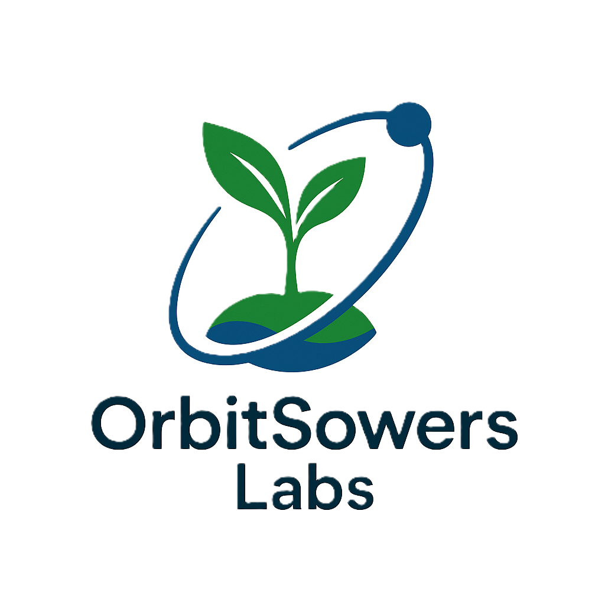
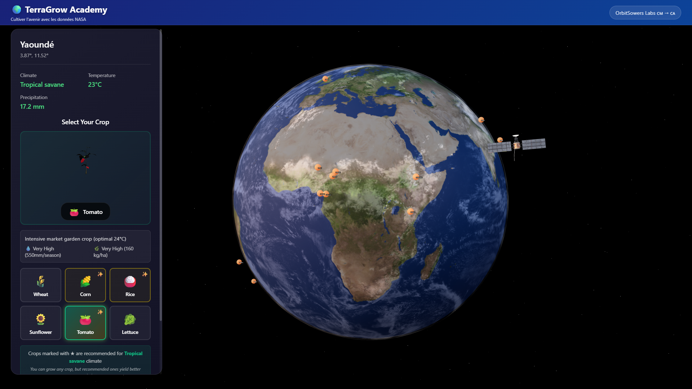
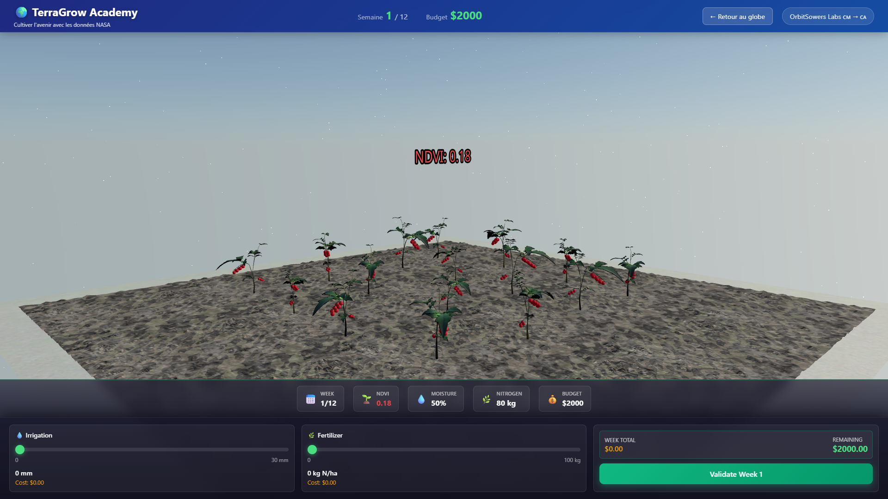
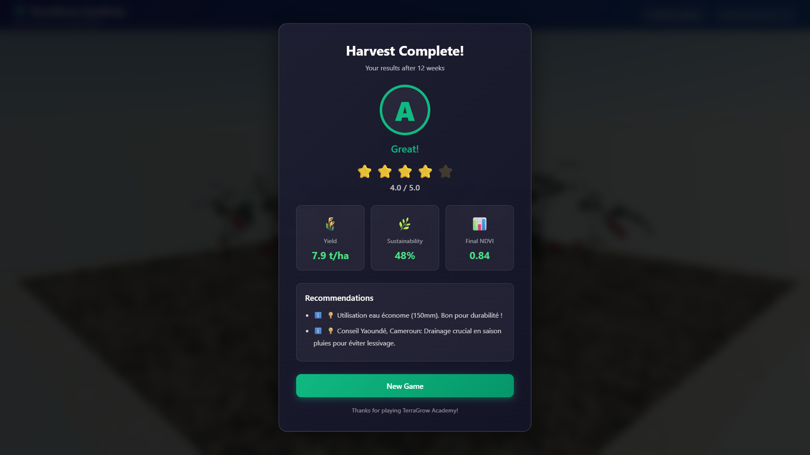

# TerraGrow Academy

Educational precision farming game powered by real NASA satellite data

<table>
  <tr>
    <td></td>
    <td align="right"></td>
  </tr>
</table>

**OrbitSowers Labs** - From Yaoundé, Cameroon to Montréal, Canada

NASA Space Apps Challenge 2025

---

## Overview

TerraGrow Academy teaches precision agriculture through an interactive 3D experience. Players manage virtual farms worldwide using real satellite data from NASA, making irrigation and fertilization decisions based on actual climate conditions.

**Key Features:**
- Interactive 3D globe with 15 pre-calculated regions
- Real-time NASA POWER API weather data
- Realistic 12-week crop simulation (wheat, corn, rice, sunflower, tomato, lettuce)
- 3D field visualization with dynamic crop growth
- Sustainability scoring system

### Screenshots

**Interactive Globe View**

*Click on any of 15 regions worldwide or use geolocation to select your farm location*

**3D Gameplay Interface**

*Monitor NDVI, soil moisture, and weather while making weekly irrigation and fertilization decisions*

**Results & Sustainability Score**

*Compare your yield to regional averages and receive personalized sustainability feedback*

---

## Quick Start

### Prerequisites
- Python 3.8+
- Node.js 18+
- pip (Python package manager)

### Installation

**1. Clone the repository**
```bash
git clone https://github.com/OrbitSowers/TerraGrow.git
cd TerraGrow
```

**2. Setup Backend**
```bash
cd backend
pip install -r requirements.txt
python app.py
```
Backend runs on `http://localhost:5000`

**3. Setup Frontend** (in a separate terminal)
```bash
cd frontend
npm install
npm run dev
```
Frontend runs on `http://localhost:3000`

**4. Open in browser**
Navigate to `http://localhost:3000`

---

## Project Structure

```
OrbitSowers_TerraGrow/
├── backend/                        # Flask REST API
│   ├── app.py                      # Main Flask application
│   ├── config.py                   # Configuration
│   ├── requirements.txt            # Python dependencies
│   ├── models/                     # Simulation models
│   │   ├── crop.py                 # Crop growth (NDVI)
│   │   ├── soil.py                 # Soil moisture & nitrogen
│   │   ├── region.py               # Climate parameters
│   │   └── game_state.py           # Game orchestration
│   └── services/                   # External APIs
│       ├── nasa_power_api.py       # NASA POWER wrapper
│       ├── geocoding_service.py    # Nominatim geocoding
│       └── data_provider.py        # Hybrid data provider
│
├── frontend/                       # React 3D Interface
│   ├── src/
│   │   ├── components/
│   │   │   ├── Scene/              # 3D components (Globe, Satellite)
│   │   │   ├── Field/              # Field visualization
│   │   │   └── UI/                 # User interface overlays
│   │   ├── hooks/                  # Custom React hooks
│   │   ├── utils/                  # Helper functions
│   │   ├── stores/                 # State management (Zustand)
│   │   └── styles/                 # Global CSS
│   ├── public/
│   │   ├── models/                 # 3D models (GLB)
│   │   └── textures/               # Earth & terrain textures
│   ├── package.json
│   └── vite.config.js
│
├── data/                           # Pre-calculated regions
│   └── regions/                    # 15 regions JSON data
│
├── assets/                         # Project assets
│   ├── logos/                      # OrbitSowers & Space Apps logos
│   └── screenshots/                # README screenshots
│
├── .gitignore
├── README.md
└── LICENSE
```

---

## Technology Stack

**Frontend:**
- React 18 - UI framework
- React Three Fiber - 3D WebGL rendering
- @react-three/drei - 3D helpers and controls
- Zustand - State management
- Vite - Build tool and dev server

**Backend:**
- Python 3.8+ with Flask - REST API
- NumPy - Scientific computing
- Requests - HTTP library

**External APIs:**
- NASA POWER API - Weather and climate data
- OpenStreetMap Nominatim - Geocoding and location search

**Data Sources:**
- 15 pre-calculated regions with high-quality satellite data
- Real-time API fallback for any location worldwide

---

## Gameplay

1. **Select Region** - Click on the globe or search for a location
2. **Choose Crop** - Pick from 6 crops based on climate recommendations
3. **Manage Farm** - Make weekly irrigation and fertilization decisions (12 weeks)
4. **Monitor Growth** - Watch NDVI, soil moisture, and weather conditions
5. **Harvest** - Receive sustainability score and yield comparison

---

## Available Regions

15 pre-calculated regions with high-quality NASA data:
- Cameroon: Yaoundé, Maroua, Douala, Garoua
- Canada: Montréal, Prairies
- Kenya: Nairobi
- Nigeria: Kano
- Ethiopia: Addis Ababa
- India: Punjab
- Brazil: São Paulo
- USA: Iowa
- France: Beauce
- Bangladesh: Dhaka
- Argentina: Pampas

Additional locations supported via real-time NASA POWER API.

---

## API Endpoints

The Flask backend provides the following REST endpoints:

- `POST /api/init` - Initialize game session with location (lat/lon)
- `POST /api/action` - Submit weekly irrigation and fertilization decisions
- `GET /api/harvest` - Get final harvest results and sustainability score
- `GET /api/search-location?q=query` - Search for locations via Nominatim
- `GET /api/popular-regions` - Get list of 15 pre-calculated regions
- `GET /api/health` - Health check endpoint

---

## Development

### Build for Production

**Backend:**
```bash
cd backend
python app.py
```

**Frontend:**
```bash
cd frontend
npm run build
npm run preview
```

### Configuration

Frontend API endpoint (`frontend/src/utils/apiClient.js`):
```javascript
const API_BASE_URL = 'http://localhost:5000/api'
```

Backend port (`backend/app.py`):
```python
app.run(debug=True, port=5000, host='0.0.0.0')
```

---

## Troubleshooting

**API Connection Failed**
- Ensure backend is running: `curl http://localhost:5000/api/health`
- Check CORS configuration in `backend/app.py`

**WebGL Context Lost**
- Refresh the page (F5)
- Reduce graphics quality in browser settings
- Check GPU acceleration is enabled

**Missing Textures or 3D Models**
- Verify files exist in `frontend/public/textures/` and `frontend/public/models/`
- Check browser console for 404 errors

**Backend Module Not Found**
```bash
cd backend
pip install -r requirements.txt
```

**Frontend Dependencies Issues**
```bash
cd frontend
rm -rf node_modules package-lock.json
npm install
```

---

## Credits

- **NASA POWER API** - Weather and climate data
- **OpenStreetMap Nominatim** - Geocoding services
- **Solar System Scope** - Earth textures
- **Poly Haven** - Terrain textures
- **Sketchfab Community** - 3D models

---

## Team

**OrbitSowers Labs** - From Yaoundé, Cameroon to Montréal, Canada

### Team Members

**Olivier Youfang Kamgang** - Aerospace Engineering Student (CEP)
[LinkedIn](https://linkedin.com/in/olivier-youfangkamgang)

**Amaury Tchoupe** - Mechanical Engineering Student (CEP)
[LinkedIn](https://linkedin.com/in/amaury-tchoupe-3b24ab190)

**Mathurin Nkinassi** - Financial Mathematics Student
[LinkedIn](https://linkedin.com/in/mathurin-nkinassi-b70b3b1a3)

**Oswald Godwill Litet** - M.Eng Electrical Engineering
[LinkedIn](https://linkedin.com/in/oswald-godwill-litet-191a36223)

### Our Mission

Democratize precision agriculture through space technology accessible to farmers worldwide.

> "Cultivating the future with NASA's eyes in the sky"

We are engineering students from Cameroon now based in Montréal. Our families farm the land back home, and we witnessed how unpredictable weather affects crop yields. Through this project, we bridge NASA's satellite technology with real-world farming challenges.

---

## License

MIT License - See LICENSE file

---

## Contact

**Team LinkedIn Profiles:**
- [Olivier Youfang Kamgang](https://linkedin.com/in/olivier-youfang-kamgang)
- [Amaury Tchoupe](https://linkedin.com/in/amaury-tchoupe-3b24ab190)
- [Mathurin Nkinassi](https://linkedin.com/in/mathurin-nkinassi-b70b3b1a3)
- [Oswald Godwill Litet](https://linkedin.com/in/oswald-godwill-litet-191a36223)

**GitHub:** [OrbitSowers/TerraGrow](https://github.com/YkorTech/OrbitSowers_TerraGrow)

---

*NASA Space Apps Challenge 2025 - Montréal*
